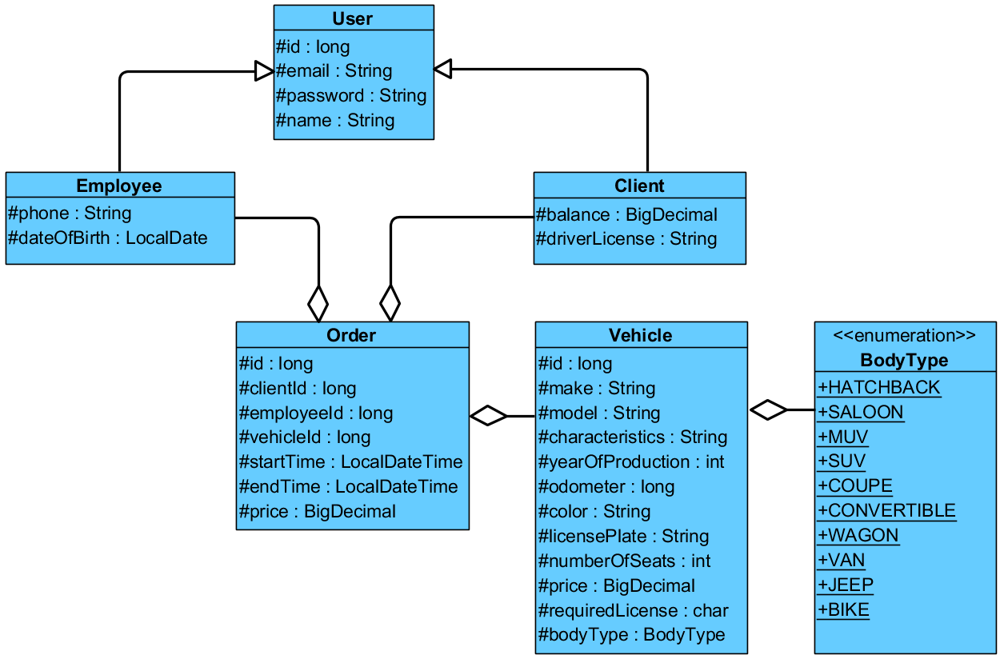

# Vehicle Rent Agency

The purpose of this exercise is to check if you understand work with input/output.

Duration: **2** hours

## Description

In this exercise you need to develop an entity classes hierarchy composition
to store data of agency’s vehicles park and orders. Also, you need to implement
`CsvStorage` service to store entities to `csv` file format.
The class diagram of the Domain model:



The `CsvStorage` interface has two methods:

- `<T> List<T> read(InputStream source, Function<String[], T> mapper) throws IOException` \
  Reads the supplied source line by line, splitting each line into a `String` array
  using `valuesDelimiter`, then passing the array to the `mapper` for each line. \
  `mapper` is a function which maps the array values to an object fields 
  (see Details section). \
  `T` is the type parameter that represents the entity class to read. \
  Returns a List of the entity class objects.

- `<T> void write(OutputStream dest, List<T> value, Function<T, String[]> mapper) throws IOException` \
  Writes the provided list of objects line by line to the provided `OutputStream`. 
  Uses 'mapper' to get an array of object fields values. \
  `mapper` is a function that converts an object fields values to a strings array.
  (see Details section).

Proceed to `CsvStorageImpl` class which implements `CsvStorage` 
and implement it.

## Details

The `CsvStorageImpl` class must have default constructor 
and the constructor that takes a `Map<String, String>`, which **can** contain 
zero or more configuration properties.
The configuration properties are:
- `String encoding` default value is '`UTF-8`'. \
  The encoding to use when reading the CSV files; must be a valid charset. 
- `String quoteCharacter` default value is '`"`'. \
  The quote character to use for _quoted strings_ (see below). 
- `String valuesDelimiter` default value is '`,`'. \
  The column delimiter character to use when reading the CSV file. 
- `boolean headerLine` default value is '`true`'. \
  If `true`, the first line is considered a header and must be ignored.

### Mapping functions

Mappers map string values to fields for the read method and fields to 
strings array for the write method.

All mapping functions must be collected in `Mapper` class.

**Writing**

- `null` must be converted to the empty string.
- Empty string must be converted to the quoted empty string `""`
> `CsvStorageImpl#write()` never writes column headers.

**Reading** 

- Empty string must be converted to `null` for referenced types 
  or to the default value for primitive types.
- Quoted empty string `""` must be converted to the empty string.
- It's guaranteed that _quoted strings_ will not contain 
  `quoteCharacter` inside data.
> String representation of a value must be `quoted` if it contains `valuesDelimiter` \
  If `valuesDelimiter = ","` and `quoteString = "'"` then the text 
  `Value, which contains comma`, must be represented as `'Value, which contains comma'`.

**Date and time formatting**

The string representation of dates in `csv` must be:
> four digits for a year then `-` then to digits for a month then `-` then two dits for a day. \
  `1978-03-21`

It is guaranteed that dates will not contain time related values.

[//]: <> (>**Hint**. You can use `SimpleDateFormatter` to do that.)

### Entity classes

Each entity class must contain default constructor, constructor 
with parameters for all fields, all necessary methods to compare 
on equality in different types of containers.
It's expected in future that objects of the classes will be
transferred over a network or stored in a file or database.

They should also be able to be represented as a string.

The string representation must satisfy the following convention:

```
Class_name{field1_name=field_value, field2_name=field_value, …}
```

- If a class inherits another class, it must include accessible 
  inherited fields before its own fields

```
Class_name{parent_class_fields, own_fields}
```

- String values must be surrounded by apostrophes: `text='value'`
- If a field is a collection or an array its value must 
  be surrounded by square braces.
- Fields must be ordered as it denoted in the UML class diagram.

#### Example of string representation:

```
class A {
    private int p = 10;
    protected int a = 1;
    protected String s = "a string";
    // ...
}
```

```
A{p=10, a=1, s='a string'}
```

```
class B extends A {
    private int b = 5;
    private String t = "a text";
    private char[] chars = {'a', 'b'};
    // ...
}
```

```
B{a=1, s='a string', b=5, t='a text', chars=[a, b]}
```
